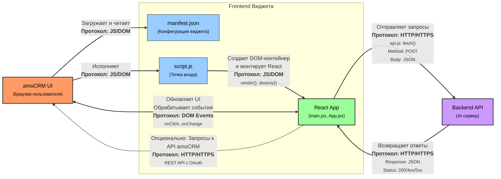

```mermaid
flowchart LR
    %% Определение узлов с улучшенным дизайном
    amoCRM["amoCRM UI<br/><small>(Браузер пользователя)</small>"]:::amoNode
    manifest["manifest.json<br/><small>(Конфигурация виджета)</small>"]:::fileNode
    script["script.js<br/><small>(Точка входа)</small>"]:::fileNode
    react["React App<br/><small>(main.jsx, App.jsx)</small>"]:::reactNode
    backend["Backend API<br/><small>(AI сервер)</small>"]:::backendNode
    
    subgraph "Frontend Виджета" 
        manifest
        script
        react
    end
    
    %% Связи с четко обозначенными протоколами
    amoCRM -->|"Загружает и читает<br/><b>Протокол: JS/DOM</b>"| manifest
    amoCRM -->|"Исполняет<br/><b>Протокол: JS/DOM</b>"| script
    
    script -->|"Создает DOM-контейнер<br/>и монтирует React<br/><b>Протокол: JS/DOM</b><br/><small>render(), destroy()</small>"| react
    
    react <-->|"Обновляет UI<br/>Обрабатывает события<br/><b>Протокол: DOM Events</b><br/><small>onClick, onChange</small>"| amoCRM
    
    react -->|"Отправляет запросы<br/><b>Протокол: HTTP/HTTPS</b><br/><small>api.js: fetch()<br/>Method: POST<br/>Body: JSON</small>"| backend
    
    backend -->|"Возвращает ответы<br/><b>Протокол: HTTP/HTTPS</b><br/><small>Response: JSON<br/>Status: 200/4xx/5xx</small>"| react
    
    react -.->|"Опционально: Запросы к API amoCRM<br/><b>Протокол: HTTP/HTTPS</b><br/><small>REST API с OAuth</small>"| amoCRM
    
    %% Стили для улучшения визуального представления
    classDef amoNode fill:#f96,stroke:#333,stroke-width:2px,color:#000,rounded
    classDef fileNode fill:#9cf,stroke:#333,stroke-width:1px,color:#000
    classDef reactNode fill:#9f9,stroke:#333,stroke-width:2px,color:#000
    classDef backendNode fill:#c9f,stroke:#333,stroke-width:2px,color:#000,rounded
    
    %% Примечания
    linkStyle default stroke-width:2px
```